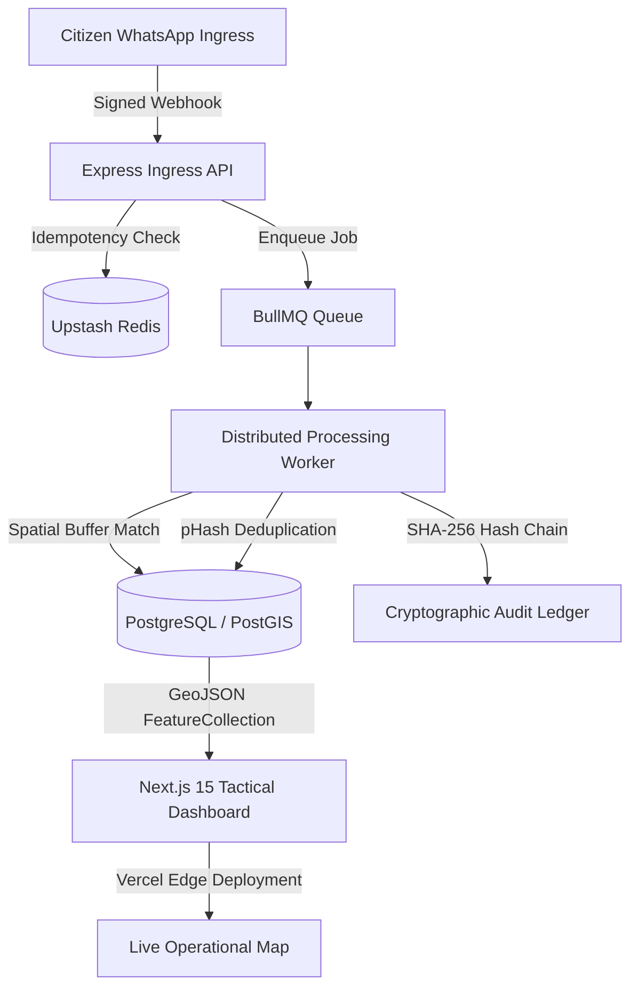

# Chhaya-Core

> Real-time civic incident intelligence platform featuring WhatsApp webhook ingress, asynchronous BullMQ/Redis worker pipelines, PostGIS spatial clustering, and a tamper-evident cryptographic audit ledger.

[](https://chhaya-core.vercel.app)
[](https://www.typescriptlang.org/)
[](https://postgis.net/)

---

## Overview

Chhaya-Core is an automated distributed system engineered to collect, deduplicate, score, and visualize emergency municipal incidents in real time. It processes high-volume citizen reporting during civic crises by turning disparate messages into actionable, auditable geospatial clusters.

### Core Capabilities
- **Webhook Ingress & Deduplication:** Handles WhatsApp report streams via Upstash Redis and BullMQ queues, deduplicating submissions using spatial buffers (`ST_DWithin`) and perceptual image hashing (`pHash`).
- **Spatial Incident Clustering:** Dynamically merges nearby reports into incident clusters with calculated Vulnerability Priority Scores (VPS) and Severity-Area Indices (SAI).
- **Verifiable Audit Ledger:** Implements an append-only, tamper-evident hash chain inspired by Crosby and Wallach's tamper-evident logging principles, providing cryptographic integrity verification over all state changes.
- **Tactical Command Dashboard:** A Next.js 15 interface rendering real-time GeoJSON cluster layers with interactive spatial inspection drawers.

---

## System Architecture



---

## Cryptographic Audit Model

Every incident receipt, deduplication merge, and priority recalculation is committed as an immutable node in a cryptographic chain:

`entry_hash[n] = SHA256(sequence_num[n] || action || entity_id || metadata || prev_hash[n-1])`

---

## Tech Stack

| Layer | Technologies |
|---|---|
| **Frontend** | Next.js 15, TypeScript, Tailwind CSS, MapLibre GL |
| **Backend** | Node.js, Express, TypeScript, Zod |
| **Data Layer** | PostgreSQL 16, PostGIS, GiST Indexing |
| **Queue** | BullMQ, Upstash Redis |
| **Deployment** | Vercel (Dashboard), Render (Worker Services) |

---

## Environment Variables

Create `.env` in `services/backend/`:
| Variable | Required | Description |
|---|---|---|
| `DATABASE_URL` | Yes | PostgreSQL connection string with PostGIS enabled |
| `UPSTASH_REDIS_REST_URL` | Yes | Upstash Redis REST endpoint for queues |
| `UPSTASH_REDIS_REST_TOKEN` | Yes | Upstash Redis authentication token |

---

## Local Setup & Execution

### 1. Prerequisites
* Node.js >= 20.x
* PostgreSQL with PostGIS extension (`CREATE EXTENSION postgis;`)
* Redis server (local or Upstash)

### 2. Installation
```bash
git clone https://github.com/avi-exe16/chhaya-core.git
cd chhaya-core
```

### 3. Backend & Worker Initialization
```bash
cd services/backend
npm install
npm run migrate:up
npm run dev
```

### 4. Running Ingestion Simulations
```bash
npm run simulate
```

### 5. Frontend Dashboard
```bash
cd ../../apps/dashboard
npm install
npm run dev
```

---

## License

MIT License